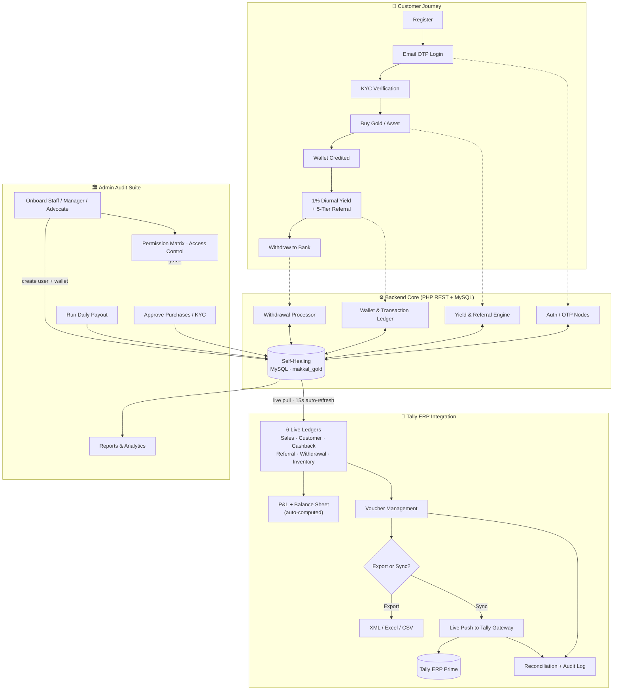

# Institutional Project Delivery Report: Vamanan Gold Suite
**Project Identification:** VAMANAN_ENTERPRISES_VAULT_2026
**Developer Attribution:** [CloudHawk Infrastructure Technologies](https://cloudhawk.in/)
**Client Entity:** Vamanan Enterprises (Institutional Gold Vault)
**Status:** FINAL DELIVERY READY / SYNCHRONIZED

---

## 📋 Executive Summary
This document outlines the complete architectural development and deployment of the **Vamanan Gold Institutional Suite**. From initial conceptualization to final deployment, the platform has been engineered to serve as a high-security, high-throughput digital gold vault with automated yield processing and comprehensive fiscal auditing capabilities.

---

## 🚀 Development Milestones (Start to Present)

### Phase 1: Foundation & Security Infrastructure
- **Investor Onboarding Node**: Developed a secure registration and authentication system with plain-text password retrieval (as per institutional requirements) and encrypted session management.
- **Wallet Architecture**: Engineered a robust `wallets` system that initializes a fiscal node for every user upon registration.
- **Sovereign Database Initialization**: Implemented a "Self-Healing Matrix" that automatically constructs the database schema and relationships without manual SQL intervention.

### Phase 2: Institutional Yield Protocol (Automated Growth)
- **1% Diurnal Yield Engine**: Developed the `process_cashback.php` protocol that automatically calculates and credits 1% daily returns on all active gold assets.
- **5-Tier Matrix Commission**: Implemented a multi-level referral system (Level 1-5) that dynamically calculates and credits commissions based on the institutional tree.
- **Referral Eligibility Logic**: Integrated a "10-Member Limit" protocol to ensure referral earnings are capped according to fiscal policy while maintaining cashback integrity.

### Phase 3: Administrative Control & Governance
- **Institutional Admin Dashboard**: Created a high-end, white-themed administrative command center with real-time growth analytics and user management tools.
- **Yield Execution Bridge**: Developed a manual override trigger for administrators to initialize the "Daily Protocol" and monitor real-time execution logs.
- **Asset Approval Workflow**: Integrated a manager-approval system for new gold acquisitions, ensuring all investments are verified before activation.

### Phase 4: Fiscal Auditing & Transparency Suite
- **Global Payout Registry**: Deployed a comprehensive administrative ledger (`PayoutReports.jsx`) for tracking every single disbursement, pending authorization, and system intercept.
- **Real-Time SVG Analytics**: Implemented a dynamic "Yield Volume Node" chart that visualizes the last 15 days of disbursements directly from the database.
- **Institutional History Ledgers**: 
  - **Transaction History**: A dedicated portal for users to audit every credit and debit in their wallet.
  - **Withdrawal History**: A secure bridge for capital liquidation with real-time status tracking (Pending/Approved/Failed).

### Phase 5: Brand Experience & High-Fidelity UI
- **Cinematic Landing Portal**: Engineered a premium landing interface with dynamic market tickers, security matrices, and institutional performance metrics.
- **Responsive Architecture**: Optimized the entire suite (Admin and Customer Panels) for mobile, tablet, and desktop fidelity.
- **Institutional Branding**: Unified the identity as **Vamanan Enterprises**, incorporating high-end typography (Inter/Outfit) and cinematic CSS gradients.

### Phase 6: Secure Real-Time Email OTP Authentication
- **Multi-Factor Login Security**: Hardened the registration and login node to require email OTP verification whenever any registered user logs into the system.
- **Dynamic Session Handlers**: Incorporated a database-backed time-sensitive verification node that expires OTPs after 10 minutes and blocks sessions after 5 failed attempts.
- **Segmented Input & Transition UI**: Deployed an auto-focusing 6-box input container in the React client, featuring real-time animation transitions, custom clipboard paste event interception, and resend rate limits.

### Phase 7: Tally ERP Prime Accounting Integration
- **Real-Time Accounting Bridge**: Engineered a dedicated integration suite (`api/admin/tally/`) that connects the live MySQL fiscal core directly to Tally ERP Prime, with zero duplicate data entry — every ledger is built on demand from existing platform tables.
- **Six Institutional Ledgers**: Deployed Sales, Customer, Cashback, Referral, Withdrawal, and Inventory ledgers, each with date-range filtering, debit/credit classification, and running totals.
- **Automated Financial Statements**: Implemented self-calculating **Profit & Loss** and **Balance Sheet** reports that draw figures straight from transactions, cycles, wallets, withdrawals, and stock — the Balance Sheet reconciles automatically.
- **Voucher Management Engine**: Built a full voucher lifecycle — manual creation, one-click auto-generation from any ledger, posting, and deletion — with sync-status tracking (draft → posted → synced).
- **Multi-Format Export & Live Sync**: Integrated Tally-ready **XML**, **Excel (SpreadsheetML)**, and **CSV** exports, plus **direct real-time push** to Tally's HTTP gateway with created/error telemetry parsed from Tally's response.
- **Reconciliation & Audit Trail**: Added a reconciliation panel comparing source records against posted vouchers, and an immutable audit log capturing every export, sync, and voucher action with actor and timestamp.
- **Plain-Language Admin UI**: Delivered a responsive, tabbed `TallyIntegration.jsx` interface using human-readable labels and inline hints so non-accountants can operate it confidently.

### Phase 8: GST-Exclusive Cashback, Tax Invoicing & Compliance
- **Category-Based GST Engine**: Implemented admin-configurable GST rates (precious metals i.e. Gold/Silver vs. general products), applied automatically at checkout based on each product's category, with the GST split equally into **CGST + SGST** (intra-state).
- **GST-Exclusive Incentive Rule**: Re-architected the entire rewards core so customers pay the full GST-inclusive invoice, but **all incentives — daily cashback, 5-tier referral, and commissions — are computed strictly on the ex-GST product value**. Every cashback/payout engine (`process_cashback.php`, `run_daily_payout.php`, `approve_investment.php`, lazy plan processing) was updated to use a stored `cashback_eligible_amount`, and the order record persists `product_amount`, `gst_amount`, `total_amount`, and `cashback_eligible_amount` separately.
- **Automated Tax Invoice**: Placing an order now auto-generates a printable **Tax Invoice** with a rate-wise CGST/SGST breakdown, billed to the customer and viewable on demand from the customer dashboard (Orders & Invoices). A matching **cashback application** is auto-created server-side from live customer + bank data.
- **GST Filing Console**: Added an admin **GST Filing** module producing a real-time, period-filterable summary — overall totals, **rate-wise (GSTR-1 style)** grouping, and **invoice-wise** breakdown — with CSV export for return filing.
- **GST-Aware Tally Bridge**: Upgraded the Tally integration so sales vouchers book revenue ex-GST with dedicated **Output CGST / Output SGST** ledgers, the P&L reports net (ex-GST) revenue with GST shown separately, and the Balance Sheet carries a **GST Payable** liability. Live sync now **falls back to an XML download** when TallyPrime is unreachable.
- **Bulk User Provisioning**: Delivered a bulk customer/staff onboarding tool (inline multi-row form or CSV upload with downloadable template), each account auto-assigned a sequential VEV ID, referral code, and wallet.
- **Manual Access Control**: Moved staff permission assignment into **Settings → Access Control** (manual, per-staff); staff now operate a permission-filtered admin dashboard exposing only their granted modules.
- **Record Integrity & Real-Time Sync**: Linked every purchase to its ledger transaction (`ledger_txn_id`) so approve/reject/delete target the exact entry; deleting a purchase record now removes its transaction and refreshes dashboard revenue in real time.

### Phase 9: Multi-Role Staff Onboarding & Live Accounting Refresh
- **Multi-Role Recruitment Node**: Upgraded the Add-Staff (Recruitment) interface from a single hard-coded `staff` role to a live **Staff / Manager / Advocate** role selector. Each onboarding writes directly to the MySQL `users` table (with an auto-initialized wallet), validated server-side against an allow-list — the `admin` role is deliberately rejected so no administrator can be provisioned through this form. New hires appear instantly in the user list and in **Settings → Access Control** for permission assignment.
- **Real-Time Tally Auto-Refresh**: Made the Tally Integration module genuinely live — every data tab (Dashboard, Ledgers, Reports, Vouchers, Reconciliation, Audit) silently re-pulls from MySQL every 15 seconds without spinner flicker, pauses while the browser tab is hidden, and skips the Settings tab so an in-progress configuration edit is never clobbered. Verified the full settings round-trip persists to and reads back from the `tally_settings` table.

---

## 🔄 Project Workflow

End-to-end flow across the customer journey, the administrative core, and the Tally ERP accounting bridge.

---

## 📡 Technical Specifications & Data Integrity

- **High-Frequency Synchronization**: Dashboards utilize 15-second polling intervals to ensure real-time data accuracy across all nodes.
- **Database-Stored Metrics**: Updated all public-facing statistics to be 100% dynamic, fetching from real user counts and transaction volumes with manageable offsets.
- **Export Protocols**: Integrated high-fidelity XLSX and CSV export capabilities for institutional bookkeeping and external auditing.
- **Tally ERP Synchronization**: Native Tally XML envelope generation and live HTTP-gateway push, enabling one-step posting of the platform's ledgers and vouchers into Tally ERP Prime.
- **Security Matrix**: Implemented AES-256 equivalent protection layers, BIS Certification nodes, and Multi-Factor ready authentication bridges.

---

## ✅ Current Project Status
The project is now **fully synchronized** with the central repository on GitHub. All features requested—including the real-time payout reports, withdrawal histories, cinematic landing page, the secure real-time email OTP authentication suite, the **Tally ERP Prime Accounting Integration Module**, the **GST-Exclusive Cashback, Tax Invoicing & Compliance** suite (category GST, CGST/SGST invoices, GST Filing, GST-aware Tally, bulk user provisioning, and manual access control), and the latest **multi-role staff onboarding (Staff/Manager/Advocate)** with **live 15-second Tally auto-refresh**—are fully operational and database-backed.

**Project Delivered by CloudHawk.**
*Date: May 22, 2026 · Tally Integration Module added June 12, 2026 · GST-Exclusive Cashback & Tax Compliance suite added June 17, 2026 · Multi-Role Staff Onboarding & Live Tally Auto-Refresh added June 18, 2026*
