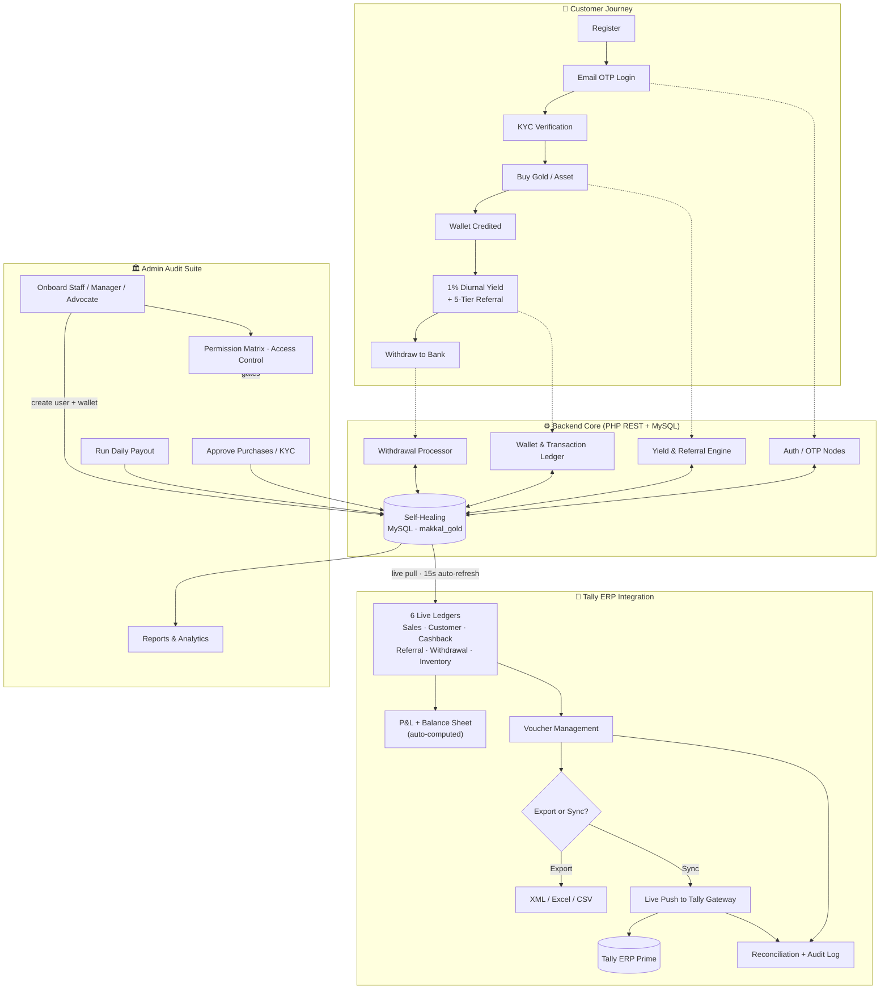

# Vamanan Enterprises V (Institutional Gold Vault)

Vamanan Enterprises V is a high-fidelity, sovereign financial suite designed for multi-tier gold asset management, automated diurnal yield protocols, and secure institutional fiscal auditing. 

The platform features a **Cinematic Landing Interface**, a **Command-Grade Admin Audit Suite**, and a **Robust PHP-REST Backend** with a self-healing database architecture.

---

## 🏛️ Institutional Features

- **Live Market Synchronization**: Real-time integration with global gold exchanges (XAU/INR) featuring automated 10-minute synchronization and direct TradingView chart validation.
- **Cinematic Landing Portal**: High-end landing page with real-time market tickers, military-grade security matrices, and dynamic institutional performance metrics.
- **Automated Yield Protocol**: Proprietary "1% Diurnal Yield" engine that processes daily cashback and 5-tier referral commissions with real-time transaction telemetry.
- **Recency-Ranked Genealogy Tree**: A live referral hierarchy that re-ranks the network by join recency — the most recently referred member is always elevated to **Level 1**, every earlier member cascades down a level automatically, and the account holder anchors the deepest level (`YOU`). The tree recalculates whenever a new referral joins, with cycle-safe traversal and near-real-time synchronization across the frontend, PHP-REST layer, and MySQL core. (Distinct from the **5-tier commission ladder**, which continues to flow up the true referral ancestry so payouts remain correct.)
- **Digital Ratification Workflow**: Secure, multi-party agreement protocol requiring Advocate Ratification and Partner Verification for all institutional gold contracts.
- **Advanced Audit Command Center**:
  - **Cashback Reports**: Premium gold-black dashboard with monthly/daily yield tracking and automated liability forecasting.
  - **Withdrawal Registry**: Secure liquidity bridge with status monitoring (Pending/Approved/Failed) and real-time alert nodes.
  - **Payout Analytics**: Institutional disbursement ledger with bank-grade artifact tracking (IFSC, A/C No) and daily velocity charts.
- **GST-Exclusive Cashback & Tax Engine**: Category-based GST (admin-configurable Gold/Silver vs. general-product rates) applied at checkout with automatic **CGST + SGST** split. Customers pay the full GST-inclusive invoice, but **every incentive — daily cashback, 5-tier referral, and commission — is calculated strictly on the ex-GST product value**; GST never contributes to any reward. Each order auto-generates a printable **Tax Invoice** (with CGST/SGST breakdown, viewable from the customer dashboard) plus a linked cashback application, and a dedicated **GST Filing** console surfaces a real-time, rate-wise (GSTR-1 style) and invoice-wise summary with CSV export.
- **Bulk User Provisioning**: One-shot creation of multiple customers/staff via an inline multi-row form or **CSV upload** (with downloadable template) — each new account is auto-assigned a sequential VEV ID, referral code, and initialized wallet.
- **Multi-Role Staff Onboarding & Permission Matrix**: Granular role-based access control (RBAC). The Add-Staff (Recruitment) node provisions **Staff, Manager, or Advocate** accounts from a single role selector — each created live in the MySQL `users` table with an auto-initialized wallet, then surfaced instantly in the access list. The `admin` role is intentionally blocked from this form. Module access is assigned **manually in Settings → Access Control**; staff then operate a permission-filtered admin dashboard showing only their granted tabs.
- **Self-Healing Database Matrix**: Zero-config database initialization that automatically constructs schemas and relationships on first request, including automated migrations for new fiscal parameters.
- **Secure Email OTP Authentication Matrix**: High-security, two-phase verification required for all logins. Upon password verification, generates a 6-digit OTP, stores its secure hash in a database session table, and dispatches a branded fintech HTML email via Gmail SMTP, integrated with segmented inputs, backspace navigation, auto-pasting, and live countdown timers in the frontend.
- **Tally ERP Prime Integration Module**: A complete real-time accounting bridge between the platform's MySQL core and Tally ERP Prime. Surfaces six live ledgers (Sales, Customer, Cashback, Referral, Withdrawal, Inventory) sourced directly from existing tables, auto-computes **Profit & Loss** and **Balance Sheet** statements, and provides full **Voucher Management** (manual create, auto-generate from any ledger, post). **GST-aware**: sales vouchers book revenue ex-GST with separate **Output CGST / Output SGST** ledgers, and the Balance Sheet carries a **GST Payable** liability. Supports **XML / Excel / CSV export**, **direct real-time synchronization** to Tally's HTTP gateway (with automatic **fallback to XML download** when Tally is offline), **transaction reconciliation** (source records vs. posted vouchers), and an immutable **audit trail** of every accounting action — all wrapped in a plain-language, responsive admin interface. Every data tab **silently auto-refreshes from MySQL every 15 seconds** (pausing when the browser tab is hidden, and skipping the Settings tab so an in-progress edit is never overwritten), keeping ledgers, reports, vouchers, and metrics genuinely live.

---

## 🔄 Project Workflow

End-to-end flow across the customer journey, the administrative core, and the Tally ERP accounting bridge.



---

## 🛠️ Technology Stack

### Frontend (Institutional Interface)
- **React.js (Vite)**: Core framework for high-throughput UI performance.
- **TailwindCSS**: Utility-first styling for a premium, custom-branded gold-black design system.
- **Framer Motion**: Cinematic micro-animations, de-blur transitions, and smooth state transitions.
- **Lucide React**: Vector-based institutional icon set.
- **Axios**: High-frequency real-time data polling (30s on dashboards, 10s on the Referral Network for near-instant genealogy updates) with automated retry logic.

### Backend (Sovereign Core)
- **PHP 8.0+ (REST API)**: High-performance backend nodes for transactional logic and market synchronization.
- **MySQL (InnoDB)**: Relational data persistence with ACID compliance and wallet-centric join logic.
- **PDO**: Secure, prepared-statement driven database layer.
- **Market Sync Engine**: Automated background fetcher for international gold spot prices.

---

## 🚀 Deployment & Initialization

### 1. Prerequisites
- **XAMPP / WAMP** (PHP 8.0+, MySQL 8.0+)
- **Node.js** (v18.0+) & **npm**

### 2. Implementation Steps
1.  **Repository Setup**:
    ```bash
    git clone https://github.com/anantha-ctrl/Vamanan-Enterprises.git
    cd Vamanan-Enterprises
    ```
2.  **Server Configuration**:
    - Move the root folder to your local server directory (e.g., `C:\xampp\htdocs\Makkal_Gold`).
    - Start **Apache** and **MySQL** via XAMPP.
3.  **Database Provisioning**:
    - The system utilizes a **Self-Healing Matrix**. 
    - Simply visit `http://localhost/Makkal_Gold/api/config.php` in your browser. The system will automatically build the `makkal_gold` database and all required tables.
4.  **Frontend Activation**:
    ```bash
    cd frontend
    npm install
    npm run dev
    ```
    - The portal will be live at `http://localhost:5173`.
    - **Environment Auto-Detection**: `frontend/src/config.js` resolves the API endpoint from `window.location.hostname` — `localhost`/`127.0.0.1` automatically targets the local XAMPP backend (`http://localhost/Vamanan1/api`), while any deployed host targets the production API (`https://vamananenterprisesv.com/api`). No manual switching or rebuild reconfiguration required.

---

## 📂 Institutional Node Structure

```
Makkal_Gold/
│
├── api/                    # Sovereign Core Backend
│   ├── admin/              # Administrative Audit & Sync Endpoints
│   │   └── tally/          # Tally ERP Integration (ledgers, reports, vouchers, export, sync)
│   ├── auth/               # Secure Authentication Nodes (Login, Register, OTP Verification & Resend)
│   ├── cron/               # Automated Yield Engines (Daily Protocol)
│   ├── customer/           # Investor-Facing Data & Ratification Nodes
│   ├── models/             # Fiscal Business Logic (Wallet, Cycle)
│   ├── config.php          # Self-Healing DB Config
│   └── config/             # DB and Mail Protocols
│
├── frontend/               # Institutional React Portal
│   ├── src/                
│   │   ├── components/     # Reusable UI Frameworks (Header, Sidebar)
│   │   ├── pages/          # High-Fidelity Views (Dashboard, Reports, etc.)
│   │   └── assets/         # Local Institutional Branding Artifacts
│   └── vite.config.js      
│
└── README.md               # Institutional Documentation
```

---

## 📡 Operational Maintenance

- **Market Sync**: The system background-syncs with global gold rates every 10 minutes. Manual sync can be triggered via the **SYNC MARKET** protocol in the Admin dashboard.
- **Daily Protocol**: Manually trigger the yield engine via the Admin Dashboard or call `/api/cron/process_cashback.php`.
- **High-Frequency Polling**: Dashboards are synchronized every 30 seconds to ensure zero-latency data viewing; the **Referral Network** genealogy polls every 10 seconds so newly-joined members surface at Level 1 almost instantly.
- **Export Protocols**: All fiscal registries support high-fidelity CSV and Ledger exports for external auditing.
- **Tally Synchronization**: Ledgers and vouchers can be exported as Tally-ready XML/Excel/CSV, or pushed live to Tally ERP Prime via its HTTP gateway (default `http://localhost:9000`). Configure company name, ledger mapping, and gateway address in the **Tally Integration → Settings** panel (all values persisted in the MySQL `tally_settings` table). The module's data tabs auto-refresh from MySQL every 15 seconds; live push requires TallyPrime to be open with the gateway enabled.

---

## ⚖️ Legal & Governance

© 2026 Vamanan Enterprises V. Developed by [CloudHawk](https://cloudhawk.in/). 
Institutional Assets protected by AES-256 Encryption. Distributed under the MIT License.
